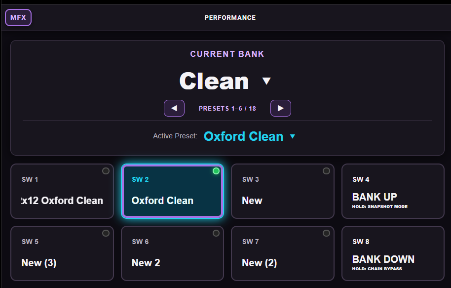
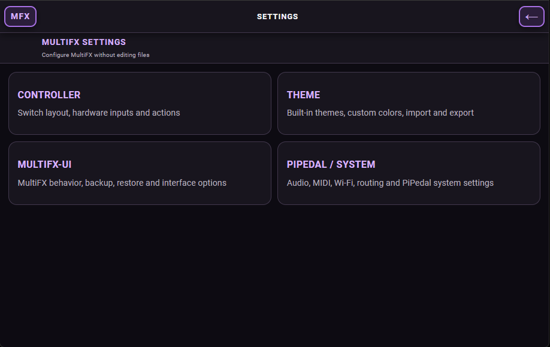
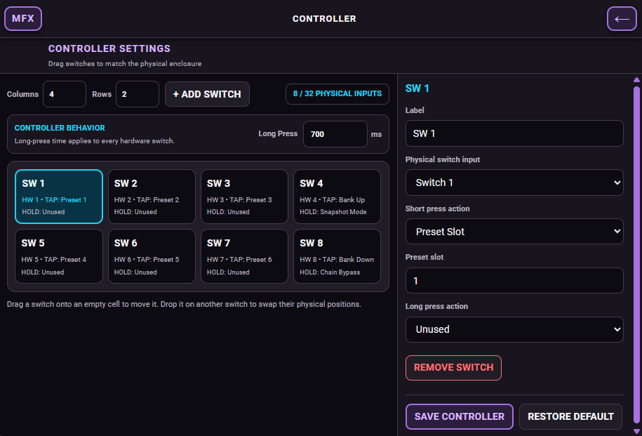
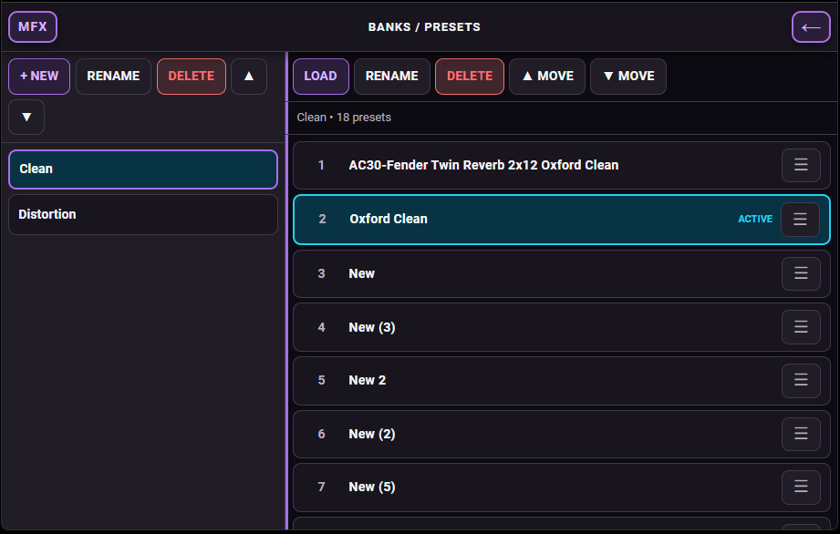
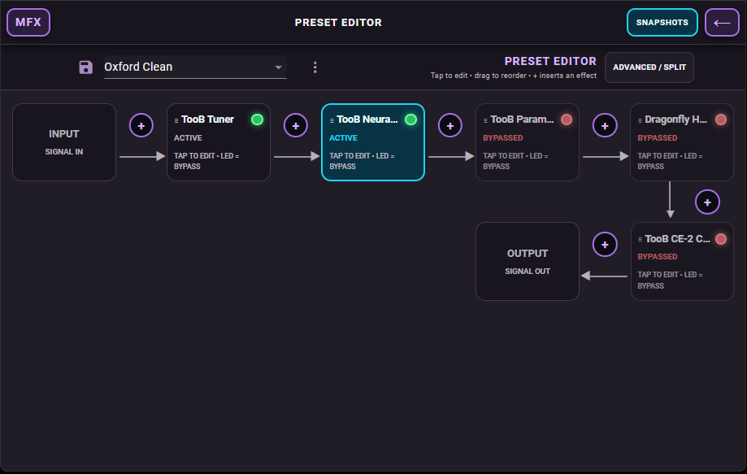
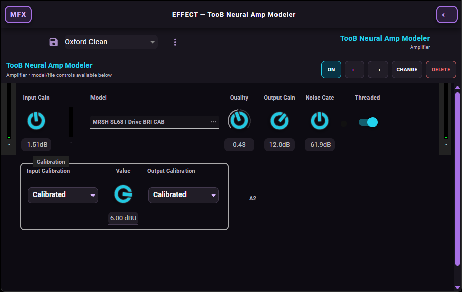
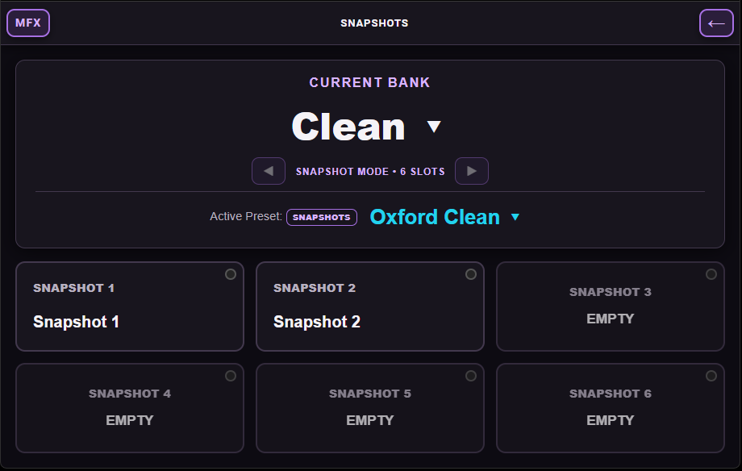
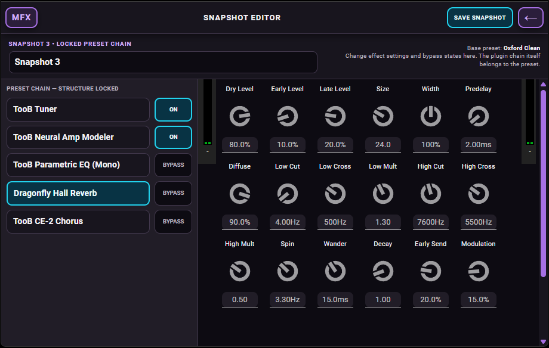
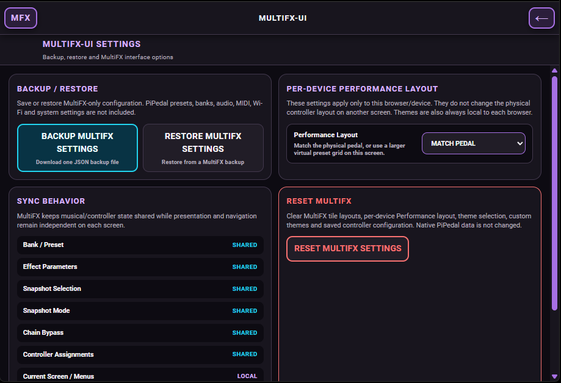
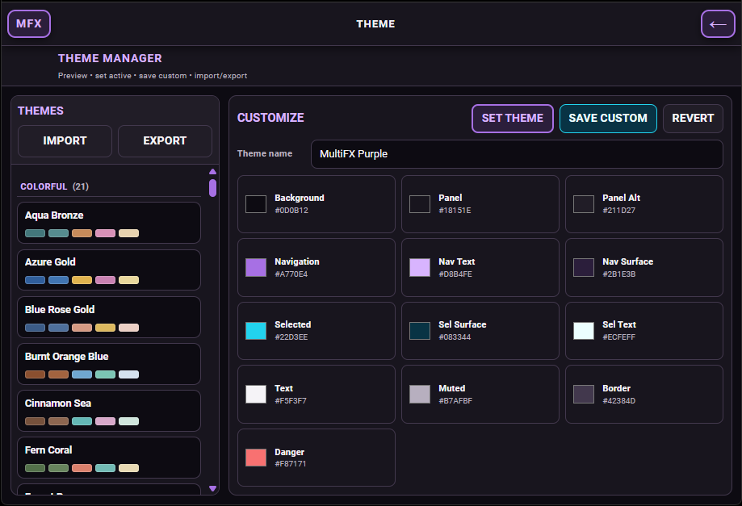

# PiPedal MultiFX

**A performance-focused touchscreen and foot-controller interface for PiPedal.**

> **AI development notice**
>
> PiPedal MultiFX is coded through collaboration with **ChatGPT by OpenAI**. The project owner defines, tests, and directs behavior while ChatGPT is used to design, write, review, document, and troubleshoot code.

PiPedal MultiFX is an unofficial alternative interface for [PiPedal](https://github.com/rerdavies/pipedal), aimed at Raspberry Pi pedalboards where fast preset access, touchscreen use, physical footswitch control, flexible controller layouts, and clear live-performance feedback matter most.

> **MultiFX does not replace the PiPedal audio engine.** PiPedal remains authoritative for audio processing, plugins, pedalboards, presets, banks, snapshots, uploaded models/IRs, and the underlying musical state.

> **Development status:** active development. `multifx-v0.1.0` is the first fully tested checkpoint of the current MultiFX architecture.

## Quick Links

- [Installation and Updates](docs/INSTALLATION.md)
- [Snapshots and Snapshot Mode](docs/Snapshots.md)
- [Controller Setup](docs/CONTROLLER_SETUP.md)
- [Controller Layout](docs/LAYOUT_CONFIGURATION.md)
- [MultiFX UI Settings / Backup and Restore](docs/MULTIFX_UI.md)
- [Themes](docs/THEMES.md)
- [Original PiPedal project](https://github.com/rerdavies/pipedal)

## Performance View



Performance View is the main live-playing screen. It shows the current real PiPedal bank, active preset, configured logical switches, and optional live status/dashboard elements.

MultiFX intentionally does **not** add a second preset-page system inside a bank. A Performance switch assignment belongs to:

```text
PiPedal bank ID + logical switch ID -> PiPedal preset ID (or empty)
```

That means the controller follows PiPedal's native bank/preset hierarchy instead of maintaining a separate virtual page system.

If you want another related group of presets, create another PiPedal bank—for example `Clean` and `Clean 2`.

## Features

### Live Performance

- Touchscreen-first Performance View
- Full mouse support for desktop/browser use
- A physical controller is optional
- Real PiPedal banks and presets
- Up to **12 logical Performance switches**
- Per-bank switch-to-preset assignments
- Duplicate preset assignments are supported
- Empty switches can remain unassigned
- Empty preset switches can be assigned or used to create a preset
- Preset assignments remain attached to the preset even when presets are reordered
- Bank cloning also clones the Performance assignment pattern to the corresponding cloned presets
- Deleting a preset clears Performance assignments that referenced it
- Deleting a bank clears its MultiFX assignment state
- Short-press and long-press switch actions
- Bank Up and Bank Down actions
- Snapshot Mode action
- Temporary Chain Bypass action
- Unused/no-action switch configuration
- Responsive tile typography
- Long names scroll with marquee behavior instead of being shrunk to unreadable text
- Current Bank and Active Preset controls
- Physical encoder navigation
- Original PiPedal screens remain available from MultiFX

### Controller Layouts

MultiFX has two controller presentation modes:

- **Grid** — automatically arranges configured switches into the selected rows and columns
- **Freeform** — allows controls and dashboard elements to be positioned and resized manually

Layout geometry is presentation-only. Moving, resizing, adding, removing, or rearranging a control does not change the musical preset assigned to its logical switch.

Freeform keeps existing controls where the user placed them. Newly added controls can be placed from the Layout editor.

Optional dashboard/status elements include:

- Current Bank
- Active Preset
- CPU Usage
- XRuns
- Temperature
- CPU frequency
- Governor
- Audio status
- Chain Bypass
- Snapshot Mode

Separate Grid and Freeform layout defaults can be saved.

See [Controller Layout](docs/LAYOUT_CONFIGURATION.md).

### Physical Controller

The current controller protocol supports **12 logical footswitches**.

Each physical footswitch reports only its neutral identity:

```text
SW1..SW12 -> MIDI CC40..CC51
```

MultiFX decides what each switch does. Preset, bank, snapshot, and bypass behavior is not hard-coded into the ESP32 firmware.

Controller features include:

- Runtime-configurable ESP32-S3 footswitch GPIO mapping
- GPIO mapping sent from MultiFX to the ESP32 over the private SysEx protocol
- GPIO assignments persisted by the ESP32
- Touch/mouse-only logical switches using `gpioPin: null`
- Endless relative rotary encoder
- Encoder push button
- USB MIDI transport
- Short-press and long-press actions configured in MultiFX
- Controller configuration shared between the floor unit and other connected browsers

See [Controller Setup](docs/CONTROLLER_SETUP.md).

### Bank / Preset Management

MultiFX includes a dedicated Bank / Preset Manager for PiPedal's native banks and presets.

Supported operations include:

- Load banks and presets
- Create banks and presets
- Rename banks and presets
- Delete banks and presets
- Reorder banks and presets
- Clone banks
- Download native PiPedal banks
- Upload native PiPedal banks
- Preserve/remap the Performance assignment pattern when a bank is cloned
- Clean up MultiFX assignments when assigned presets or banks are deleted

### Preset and Effect Editing

MultiFX provides its own performance-oriented preset editing screens while continuing to operate on PiPedal's native pedalboard model.

Features include:

- MultiFX Preset Editor
- Effect/plugin editor
- Effect bypass control
- Plugin/effect browsing
- Base-preset editing
- Access back to the Original PiPedal interface when the full native editor is preferred

### Snapshots

MultiFX uses **PiPedal's native six snapshot slots**. It does not create a separate snapshot storage system.

Snapshot features include:

- Performance-focused Snapshot Mode
- Recall from touchscreen
- Recall from configured physical switches
- Create snapshots
- Edit/update snapshots
- Rename snapshots
- Set snapshot colors
- Delete snapshots
- Snapshot Editor with the pedalboard structure locked
- Safe snapshot persistence that restores the saved base preset before saving snapshot data
- Return to the real saved base preset by reselecting the active preset

Active-preset state is indicated in Performance View:

```text
Green            clean base preset
Flashing yellow  unsaved base-preset change
Blue             native PiPedal snapshot selected
Red              temporary Chain Bypass
```

See [Snapshots and Snapshot Mode](docs/Snapshots.md).

### Chain Bypass

Chain Bypass is a temporary live-performance mode for bypassing the active chain without turning it into permanent preset data.

Chain Bypass is transient runtime state and returns to neutral when the MultiFX bridge restarts.

### Themes

MultiFX includes a Theme Manager with:

- Built-in themes
- Live preview
- Custom color-role editing
- Save Custom
- Import
- Export
- Revert

Theme state is local to each browser/device, allowing the floor unit and a desktop browser to use different visual themes while controlling the same musical state.

See [Themes](docs/THEMES.md).

### Backup, Restore, and Reset

MultiFX can export its current configuration to a JSON backup and restore that backup later.

Backup/restore covers MultiFX configuration such as:

- Controller configuration
- Controller layout
- Per-bank Performance switch assignments
- MultiFX UI configuration included in the current backup format

Reset returns MultiFX configuration to current factory defaults and clears MultiFX Performance assignments/themes without deleting native PiPedal banks, presets, or audio configuration.

Only the current backup/config format is accepted during development; obsolete formats are intentionally not migrated.

See [MultiFX UI Settings / Backup and Restore](docs/MULTIFX_UI.md).

## Interface Tour

### Performance View


The main live-performance screen. It combines native PiPedal bank/preset state with configurable Performance switches and optional status widgets.

### Settings Hub



The MultiFX settings hub provides access to controller configuration, MultiFX UI settings, themes, PiPedal settings, and other configuration screens.

### Controller Settings



Configure logical switches, physical GPIO connections, switch actions, long-press behavior, and controller layout.

A switch does not need a GPIO connection. Touchscreen/mouse-only switches can be created with no physical controller attached.

### Bank / Preset Manager



Manage PiPedal's native banks and presets while preserving MultiFX Performance assignments.

### Preset Editor



Edit the active base preset/pedalboard from the MultiFX interface.

### Effect Editor



Open an effect/plugin and edit its controls from the touchscreen-oriented MultiFX editor.

### Snapshot Mode



Snapshot Mode replaces normal preset tiles with the six native PiPedal snapshot slots belonging to the currently loaded preset.

### Snapshot Editor



Edit snapshot effect values and bypass states while keeping the underlying preset topology locked.

### MultiFX UI Settings



Manage MultiFX-specific UI configuration, backup/restore, reset, and related behavior without changing PiPedal-owned musical data.

### Theme Manager



Preview built-in themes, customize visual roles, and import/export custom theme data.

## Installation

PiPedal MultiFX can be installed on top of an existing PiPedal installation,
or the included setup menu can install/update PiPedal, install MultiFX, and
optionally configure the fullscreen touchscreen display.

### Recommended Hardware

- Raspberry Pi 5
- Raspberry Pi OS
- Working internet connection
- 7-inch or larger touchscreen
- 1024×600 or higher resolution
- PiPedal already installed if you only want to add MultiFX

A physical ESP32 controller is **not required**. Performance switches can be used entirely by touchscreen or mouse.

### Option A — Add MultiFX to an Existing PiPedal Installation

For packaged installs, download and extract the Raspberry Pi ZIP from a published PiPedal MultiFX release.

From inside the extracted package, launch the all-in-one menu:

```bash
sudo ./mfxinstaller.sh
```

Choose **Install / change MultiFX version**. The older `install-multifx.sh` command is
kept as a compatibility shortcut and now calls the same consolidated installer.

The installer:

- verifies that PiPedal is present
- installs required MultiFX runtime dependencies; on Debian 13/Trixie it can
  enable the official `trixie-backports` repository after confirmation when
  that repository is needed for `ydotool`
- backs up the existing PiPedal frontend the first time MultiFX is installed
- installs the prebuilt MultiFX frontend
- installs the MultiFX bridge
- installs and restarts the required systemd services
- creates the frontend link to the controller configuration
- keeps PiPedal's audio engine and native musical data under PiPedal's control

At startup, the setup utility checks `mfxinstaller.sh` on the repository's
`main` branch. A changed script is accepted only after its GitHub blob SHA and
Bash syntax are verified, and the user is asked before the installed setup tool
is replaced and restarted. Use `--no-self-update` to skip this check.

MultiFX does not change PiPedal's audio-device settings. Configure and test the
interface in PiPedal itself; 48000 Hz is the recommended starting sample rate.

For the full install/update procedure, see [Installation and Updates](docs/INSTALLATION.md).

### Option B — All-in-One PiPedal / MultiFX Setup Menu

The Raspberry Pi package also includes:

```bash
sudo ./mfxinstaller.sh
```

The streamlined setup menu provides:

```text
1) Install / change PiPedal version
2) Install / change MultiFX version
3) Complete setup: PiPedal + MultiFX + touchscreen
4) Create full backup
5) Restore backup
6) Completely remove MultiFX
7) Completely remove PiPedal + MultiFX
8) Set up touchscreen display
9) Status and diagnostics
0) Exit
```

The setup script lists compatible published PiPedal and MultiFX versions. The
latest stable version is selected by default and marked **Latest**, while older
versions and packaged prereleases can be selected for intentional downgrades.
Menus support arrow keys, Enter and numbered choices. The script detects the
normal login user rather than assuming a particular home directory.

Backups are compressed under `~/mfxbackups` and include PiPedal presets,
configuration, uploaded NAM/IR files, LV2 locations, MultiFX controller/runtime
state, service definitions and touchscreen configuration.

The optional touchscreen action reproduces the Raspberry Pi display setup used
by the project: Labwc, an automatically maximized Chromium app window, and the
Squeekboard on-screen keyboard. It deliberately does not use Chromium kiosk
mode because kiosk mode prevents the keyboard from working correctly.

After the first run, the same menu is available as:

```bash
sudo pipedal-multifx-setup
```

In MultiFX Settings, open **PiPedal / System** and select PiPedal's existing
**Check for updates** action. MultiFX displays the result in its own update
view. Installing an update installs PiPedal's complete stock server and
frontend. MultiFX-owned controller configuration, layouts and runtime state are
retained, but MultiFX should be reinstalled only after its compatibility with
the new PiPedal release has been confirmed.

Advanced command-line options for a specific release tag, a prerelease, or a
local extracted package are documented in
[Installation and Updates](docs/INSTALLATION.md).

### Updating MultiFX

Extract the newer Raspberry Pi package and run:

```bash
sudo ./install-multifx.sh
```

Native PiPedal presets, banks, uploaded models/IRs, and audio configuration are not intentionally modified by the MultiFX installer.

### Uninstalling MultiFX

From an extracted package:

```bash
sudo ./uninstall-multifx.sh
```

After installation, a stable uninstaller is also installed at:

```bash
sudo /usr/local/sbin/uninstall-pipedal-multifx
```

The uninstaller first offers a compressed safety backup, restores the PiPedal
frontend that existed before MultiFX, and then removes the bridge, controller
configuration, services and all MultiFX runtime state. The setup tool and
`~/mfxbackups` remain. PiPedal itself is not removed unless the separate full
PiPedal removal option is selected.

### Important Runtime Paths

```text
MultiFX frontend:
  /etc/pipedal/react/

Controller factory/config file:
  /etc/pipedal/controller-config.json

MultiFX controller bridge:
  /usr/local/lib/pipedal-multifx/pipedal_encoder_bridge.py

MultiFX state (removed by complete uninstall):
  /var/lib/pipedal-multifx/

Installer restore data (removed by complete uninstall):
  /var/lib/pipedal-multifx-installer/

User-created compressed backups:
  ~/mfxbackups/
```

### Troubleshooting

Check the controller bridge:

```bash
systemctl status pipedal-encoder.service --no-pager
```

Check the input/refresh service:

```bash
systemctl status pipedal-ydotoold.service --no-pager
```

View recent controller bridge logs:

```bash
journalctl -u pipedal-encoder.service -n 50 --no-pager
```

If a MIDI controller is connected, the bridge log should show the available MIDI inputs and which input was selected.

## ESP32-S3 Controller Firmware

The canonical firmware is:

```text
multifx/esp32s3/PiPedal_MultiFX_Controller/PiPedal_MultiFX_Controller.ino
```

The current firmware mapping is:

```text
Encoder A:     GPIO 18
Encoder B:     GPIO 17
Encoder push:  GPIO 21

Pot 1:         GPIO 8  -> CC10
Pot 2:         GPIO 12 -> CC11
Pot 3:         GPIO 13 -> CC12
Pot 4:         GPIO 11 -> CC13

Footswitches:  SW1..SW12 -> CC40..CC51
Encoder turn:  CC30, relative two's-complement
Encoder push:  CC31
```

The default footswitch GPIOs for SW1..SW8 are:

```text
SW1 GPIO6
SW2 GPIO7
SW3 GPIO15
SW4 GPIO16
SW5 GPIO1
SW6 GPIO2
SW7 GPIO4
SW8 GPIO5
```

SW9..SW12 are disabled by default until configured.

Footswitch GPIO mapping is sent to the ESP32 at runtime by the MultiFX bridge and stored in ESP32 Preferences.

The current firmware permits these footswitch GPIOs:

```text
1, 2, 3, 4, 5, 6, 7, 9, 10, 14, 15, 16, 39, 40, 41, 42, 47
```

Pins already used by the encoder, pots, USB, or unsafe ESP32-S3 flash/PSRAM/strapping functions are intentionally excluded.

Protocol details are in:

```text
multifx/MULTIFX_CONTROLLER_PROTOCOL.txt
```

See [Controller Setup](docs/CONTROLLER_SETUP.md).

## State Model

MultiFX separates shared musical/controller state from browser-local presentation state.

### Shared Across Connected Clients

- Native bank and preset selection
- Effect/control values
- Native snapshot selection
- MultiFX Snapshot Mode
- Chain Bypass
- Controller configuration/layout
- Per-bank Performance preset assignments

### Local to Each Browser/Device

- Performance View vs Original PiPedal View
- MultiFX internal screen/menu/dialog navigation
- Theme
- Local focus/highlight state

The MultiFX bridge stores durable controller configuration and per-bank switch assignments in:

```text
/var/lib/pipedal-multifx/state.json
```

Snapshot Mode and Chain Bypass are temporary live state and return to neutral when the bridge restarts.

Browser localStorage is a presentation/cache layer and is not the authoritative source for shared controller configuration.

## Configuration Compatibility During Development

MultiFX currently uses a strict current schema intentionally.

Obsolete controller configurations, old preset-tile/page stores, and old backup formats are **not migrated**. This keeps compatibility code from accumulating while the architecture is still being stabilized.

The current assignment model is:

```text
PiPedal bank ID + logical switch ID -> PiPedal preset ID (or empty)
```

Layout geometry never changes that musical mapping.

## Development

Development takes place on `dev`.

Tested working states are merged into `main`, and known-good checkpoints can be tagged from tested commits.

Frontend development:

```bash
cd vite
npm run build
```

The repository also contains a GitHub Actions workflow for assembling a Raspberry Pi package with the built frontend, MultiFX runtime files, systemd services, and install/uninstall scripts.

## Documentation

- [Installation and Updates](docs/INSTALLATION.md)
- [Snapshots and Snapshot Mode](docs/Snapshots.md)
- [Controller Setup](docs/CONTROLLER_SETUP.md)
- [Controller Layout](docs/LAYOUT_CONFIGURATION.md)
- [MultiFX UI Settings / Backup and Restore](docs/MULTIFX_UI.md)
- [Themes](docs/THEMES.md)

For PiPedal audio setup, plugins, audio interfaces, networking, and other PiPedal-native functionality, see the [original PiPedal project and documentation](https://github.com/rerdavies/pipedal).

## About PiPedal

PiPedal MultiFX is built on the open-source [PiPedal](https://github.com/rerdavies/pipedal) project by Robin Davies.

MultiFX uses PiPedal's native model and operations wherever possible instead of duplicating the audio engine, preset store, bank store, or snapshot system.

PiPedal MultiFX is **not an official PiPedal project**.

## License

See [LICENSE.md](LICENSE.md).
